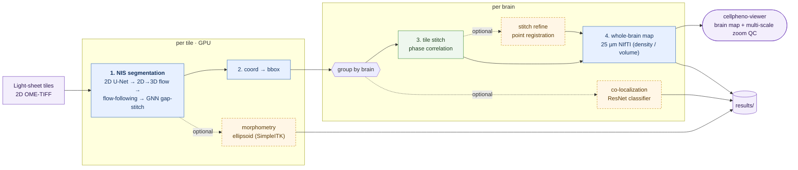

# CellPheno — whole-brain 3D nuclei instance segmentation & phenotyping

[](https://www.nextflow.io/)
[](https://www.docker.com/)
[](https://apptainer.org/)
[](https://www.biorxiv.org/content/10.64898/2026.03.17.712391v1)

## Introduction

**CellPheno** is a Nextflow (DSL2) pipeline for **high-throughput 3D nuclei instance
segmentation and phenotyping of whole mouse brains** imaged by light-sheet fluorescence
microscopy (LSFM). It takes raw 2D LSFM tiles (single-channel 16-bit OME-TIFF stacks) and
runs the whole chain — segmentation → tile stitching → whole-brain map → optional
morphometry & co-localization — in **one `nextflow run`**, producing whole-brain feature
maps you can explore interactively in
**[cellpheno-viewer](https://cellpheno-viewer.ziquanw.com/)**.

## Pipeline summary



| # | Step | Module | Method |
|---|------|--------|--------|
| 1 | **NIS segmentation** | `cellpheno/nis` (C++/LibTorch, GPU) | 2D **U-Net** per slice → median-filter-pyramid **2D→3D flow** → flow-following instance extraction → **GNN** gap-stitch across depth-chunks |
| 2 | **Bounding boxes** | `cellpheno/coordtobbox` | per-instance 3D boxes for stitching |
| 3 | **Tile stitching** | `cellpheno/stitch` (+ optional `cellpheno/stitchrefine`) | **phase correlation**, optional **point-registration** refinement |
| 4 | **Whole-brain map** | `cellpheno/brainmap` | de-duplicate overlaps & fuse into a downsampled **25 µm NIfTI** (cell count / average volume) |
| – | **Morphometry** (optional) | `cellpheno/morphometry` | per-nucleus **ellipsoid** principal axes (SimpleITK) |
| – | **Co-localization** (optional) | `cellpheno/coloc` | multi-channel **ResNet** marker classification |

## Motivations

- No prior method delivers **high-throughput nuclei instance segmentation for a whole brain**.
- Light-sheet microscopy 3D images have **anisotropic resolution**.
- Resolution is isotropic in the X–Y plane — where humans annotate nuclei — and is then
  tracked through the Z stack.

## Performance and time cost

- Recall **> 90 %**
- Precision **> 90 %**
- Time cost ≈ **15 h/brain** (128 CPU cores + a 48 GB GPU)

## Data

- We segmented multiple whole mouse brains across growth stages **P4** and **P14**.
- P4 brains are ~**1,500 × 9,000 × 9,000 voxels**, with about **30–50 million nuclei** each.

## Example: test one partial brain (with Nextflow)

Prepare a samplesheet with one row per **tile** of a brain:

```csv
brain,pair,tile_x,tile_y,tile_dir,image_dir,device
test_brain,test_pair,0,0,downloads/data/test_pair/test_brain/UltraII[00 x 00],downloads/data/test_pair/test_brain,cuda:0
test_brain,test_pair,0,1,downloads/data/test_pair/test_brain/UltraII[00 x 01],downloads/data/test_pair/test_brain,cuda:0
test_brain,test_pair,1,0,downloads/data/test_pair/test_brain/UltraII[01 x 00],downloads/data/test_pair/test_brain,cuda:0
test_brain,test_pair,1,1,downloads/data/test_pair/test_brain/UltraII[01 x 01],downloads/data/test_pair/test_brain,cuda:0
```

Smoke-test the wiring (no GPU/data/container needed):

```bash
nextflow run . -profile test -stub
```

Run the whole pipeline on the tiles:

```bash
nextflow run . -profile docker \
    --input samplesheet.csv \
    --models downloads/resource \
    --outdir results
```

Use `-profile singularity` for Apptainer/Singularity. Enable optional stages with
`--run_stitchrefine`, `--run_morphometry`, `--run_coloc`. Raw tile-folder and slice
filename conventions are configurable (`--image_tile_pattern`, `--slice_filename_pattern`).
Outputs land in `results/` (`nis/`, `bbox/`, `stitch/`, `brainmap/`, …). Full
module/parameter reference: [`docs/pipeline.md`](docs/pipeline.md).

## Web app: Interactive visualization of whole brain nuclei segmentation results

The whole-brain maps (`brainmap/<brain>/*.nii.gz`) and stitched segmentation are explored
in **cellpheno-viewer** — a niivue web app for **visual QC of stitching and segmentation
from global to local**:

- **Global brain-map view** — render the 25 µm density/feature map of the whole brain.
- **On-demand multi-scale zoom** — drill from the whole-brain map down to individual tiles
  and nuclei to inspect stitch seams and segmentation quality.

The frontend is a static SPA that needs a **data backend** (MinIO/S3 object store + the
on-demand zoom service) installed on your node — see the repo for setup:

- **Repository:** <https://github.com/Chrisa142857/cellpheno-viewer>
- **Live demo (HTTPS):** <https://cellpheno-viewer.ziquanw.com/>

## Codes availability

- [x] Train 2D U-Net (`train_unet/`)
- [x] Source code of the whole-brain C++ executable (`cpp/`)
- [x] Nextflow pipeline (this repo) + per-step CLI wrappers (`bin/`)

## Data availability

See <https://bossdb.org/project/curtin2026>.

## Citation

> Wei Z, *et al.* CellPheno: high-throughput whole-brain 3D nuclei instance segmentation
> for light-sheet microscopy. *bioRxiv* (2026).
> doi:[10.64898/2026.03.17.712391](https://www.biorxiv.org/content/10.64898/2026.03.17.712391v1)

Built with [Nextflow](https://www.nextflow.io/), following [nf-core](https://nf-co.re/) module conventions.
