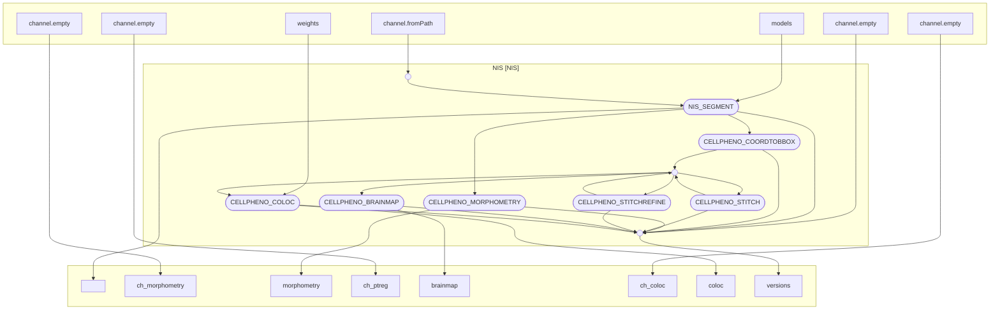

# CellPheno — whole-brain 3D nuclei instance segmentation & phenotyping

[](https://www.nextflow.io/)
[](https://www.docker.com/)
[](https://apptainer.org/)
[](https://www.biorxiv.org/content/10.64898/2026.03.17.712391v1)

## Introduction

**CellPheno** is a Nextflow (DSL2) pipeline for **high-throughput 3D nuclei instance
segmentation and phenotyping of whole mouse brains** imaged by light-sheet fluorescence
microscopy (LSFM). A single P4 brain is ~1,500 × 9,000 × 9,000 voxels containing
**30–50 million nuclei**; CellPheno segments every nucleus at **>90 % precision and
recall in ~15 h/brain**, explicitly handling the anisotropic Z resolution that defeats
off-the-shelf 2D/3D segmenters.

It takes raw 2D LSFM tiles (single-channel 16-bit OME-TIFF stacks) and runs the whole
chain — segmentation → tile stitching → whole-brain map → optional morphometry &
co-localization — in **one `nextflow run`**, producing whole-brain feature maps you can
explore interactively in **[cellpheno-viewer](https://cellpheno-viewer.ziquanw.com/)**.

## Pipeline summary



| # | Step | Module | Method |
|---|------|--------|--------|
| 1 | **NIS segmentation** | `cellpheno/nis` (C++/LibTorch, GPU) | 2D **U-Net** per slice → median-filter-pyramid **2D→3D flow** → flow-following instance extraction → **GNN** gap-stitch across depth-chunks |
| 2 | **Bounding boxes** | `cellpheno/coordtobbox` | per-instance 3D boxes for stitching |
| 3 | **Tile stitching** | `cellpheno/stitch` (+ optional `cellpheno/stitchrefine`) | **phase correlation**, optional **point-registration** refinement |
| 4 | **Whole-brain map** | `cellpheno/brainmap` | de-duplicate overlaps & fuse into a downsampled **25 µm NIfTI** (cell count / average volume) |
| – | **Morphometry** (optional) | `cellpheno/morphometry` | per-nucleus **ellipsoid** principal axes (SimpleITK) |
| – | **Co-localization** (optional) | `cellpheno/coloc` | multi-channel **ResNet** marker classification |

> The `cellpheno/nis` C++ executable is also published as a standalone
> [nf-core module](https://github.com/nf-core/modules) (container
> `quay.io/nf-core/cellpheno-nis`). See [`docs/pipeline.md`](docs/pipeline.md) for the
> full module/parameter reference.

## Usage

> [!NOTE]
> A CUDA GPU + Docker/Singularity is required for a real run. Run
> `nextflow run . -profile test -stub` first to smoke-test the wiring with no GPU/data.

Prepare a samplesheet with one row per **tile** of a brain:

```csv
brain,pair,tile_x,tile_y,tile_dir,image_dir,device
brainA,pair1,0,0,data/pair1/brainA/UltraII[00 x 00],data/pair1/brainA,cuda:0
brainA,pair1,0,1,data/pair1/brainA/UltraII[00 x 01],data/pair1/brainA,cuda:0
brainA,pair1,1,0,data/pair1/brainA/UltraII[01 x 00],data/pair1/brainA,cuda:0
brainA,pair1,1,1,data/pair1/brainA/UltraII[01 x 01],data/pair1/brainA,cuda:0
```

Run the whole pipeline:

```bash
nextflow run . -profile docker \
    --input samplesheet.csv \
    --models /path/to/NIS/torchscript/models \
    --outdir results
```

Use `-profile singularity` for Apptainer/Singularity. Enable optional stages with
`--run_morphometry`, `--run_stitchrefine`, `--run_coloc`. Raw tile-folder and slice
filename conventions are configurable (`--image_tile_pattern`, `--slice_filename_pattern`).
Full options: [`docs/pipeline.md`](docs/pipeline.md).

## Results & visualization

Outputs land in `results/` (`nis/`, `bbox/`, `stitch/`, `brainmap/`, `morphometry/`,
`coloc/`). The whole-brain maps (`brainmap/<brain>/*.nii.gz`) are best explored in
**[cellpheno-viewer](https://cellpheno-viewer.ziquanw.com/)** — a niivue web app for
**visual QC of stitching and segmentation from global to local**:

- **Global brain-map view** — render the 25 µm density/feature map of the whole brain.
- **On-demand multi-scale zoom** — drill from the whole-brain map down to individual
  tiles and nuclei to inspect stitch seams and segmentation quality.

The viewer is a static SPA; point it at your own data backend (MinIO/S3 + the on-demand
zoom service). Live demo: <https://cellpheno-viewer.ziquanw.com/>.

## Performance & scale

- Recall **> 90 %**, Precision **> 90 %**
- ~**15 h/brain** (128 CPU cores + a 48 GB GPU)
- P4 brains: ~1,500 × 9,000 × 9,000 voxels, ~30–50 M nuclei (P4 & P14 stages segmented)

## Running the steps manually

The pipeline wraps standalone research scripts; to run a step by hand, see
[`cpp/README.md`](cpp/README.md) (segmentation) and [`coloc/README.md`](coloc/README.md),
or the per-step CLI wrappers in [`bin/`](bin). The legacy command-line workflow is:
`cpp/main` → `coord_to_bbox.py` → `image_stitch/stitch_main.py` →
(`image_stitch/ptreg_stitch.py`) → `gen_brain_map.py` → (`coloc/…inferNIS.py`).

## Code & data availability

- **Code:** 2D U-Net training (`train_unet/`) and the whole-brain C++ executable (`cpp/`).
- **Data:** whole-brain datasets on **BossDB** — <https://bossdb.org/project/curtin2026>.
- **Frontend:** <https://github.com/Chrisa142857/cellpheno-viewer>.

## Citation

If you use CellPheno, please cite the preprint:

> Wei Z, *et al.* CellPheno: high-throughput whole-brain 3D nuclei instance segmentation
> for light-sheet microscopy. *bioRxiv* (2026).
> doi:[10.64898/2026.03.17.712391](https://www.biorxiv.org/content/10.64898/2026.03.17.712391v1)

This pipeline is built with [Nextflow](https://www.nextflow.io/) and follows
[nf-core](https://nf-co.re/) module conventions.
